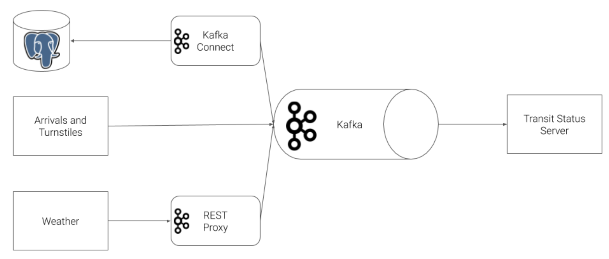
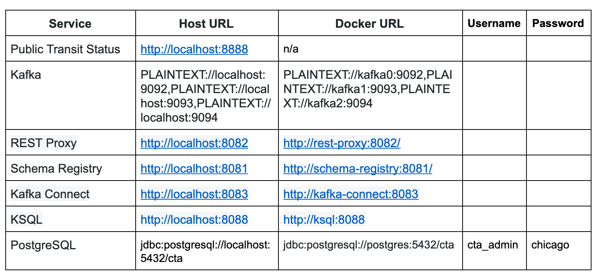

# Public Transit Status with Apache Kafka

In this project, we construct a streaming event pipeline around Apache Kafka and its ecosystem. Using public data from the [Chicago Transit Authority](https://www.transitchicago.com/data/) we will construct an event pipeline around Kafka that allows us to simulate and display the status of train lines in real time.

## Prerequisites
* Docker
* Python 3.7
* Access to a computer with a minimum of 16gb+ RAM and a 4-core CPU to execute the simulation

## Description

The Chicago Transit Authority (CTA) has asked us to develop a dashboard displaying system status for its commuters. This project uses Kafka and ecosystem tools like REST Proxy and Kafka Connect to accomplish this task.

Our architecture will look like so:



## Other Resources and Documentation
You may find the following examples and documentation helpful.

* [Confluent Python Client Documentation](https://docs.confluent.io/current/clients/confluent-kafka-python/#)
* [Confluent Python Client Usage and Examples](https://github.com/confluentinc/confluent-kafka-python#usage)
* [REST Proxy API Reference](https://docs.confluent.io/current/kafka-rest/api.html#post--topics-(string-topic_name))
* [Kafka Connect JDBC Source Connector Configuration Options](https://docs.confluent.io/current/connect/kafka-connect-jdbc/source-connector/source_config_options.html)

## Directory Layout
The project consists of two main directories, producers and consumers.

The following directory layout indicates with a * the files that the student is responsible for modifying. Instructions for what is required are present as comments in each file.


## Running and Testing

To run the simulation, you must first start up the Kafka ecosystem on their machine utilizing Docker Compose.

```%> docker-compose up```

Docker compose will take a 3-5 minutes to start, depending on your hardware. Please be patient and wait for the docker-compose logs to slow down or stop before beginning the simulation.

Once docker-compose is ready, the following services will be available:



Note that to access these services from your own machine, you will always use the `Host URL` column.

When configuring services that run within Docker Compose, like **Kafka Connect you must use the Docker URL**. When you configure the JDBC Source Kafka Connector, for example, you will want to use the value from the `Docker URL` column.

### Running the Simulation

There are two pieces to the simulation, the `producer` and `consumer`. As you develop each piece of the code, it is recommended that you only run one piece of the project at a time.

However, when you are ready to verify the end-to-end system prior to submission, it is critical that you open a terminal window for each piece and run them at the same time. **If you do not run both the producer and consumer at the same time you will not be able to successfully complete the project**.

#### To run the `producer`:

1. `cd producers`
2. `virtualenv venv`
3. `. venv/bin/activate`
4. `pip install -r requirements.txt`
5. `python simulation.py`

Once the simulation is running, you may hit `Ctrl+C` at any time to exit.

#### To run the Faust Stream Processing Application:
1. `cd consumers`
2. `virtualenv venv`
3. `. venv/bin/activate`
4. `pip install -r requirements.txt`
5. `faust -A faust_stream worker -l info`


#### To run the KSQL Creation Script:
1. `cd consumers`
2. `virtualenv venv`
3. `. venv/bin/activate`
4. `pip install -r requirements.txt`
5. `python ksql.py`

#### To run the `consumer`:

** NOTE **: Do not run the consumer until you have reached Step 6!
1. `cd consumers`
2. `virtualenv venv`
3. `. venv/bin/activate`
4. `pip install -r requirements.txt`
5. `python server.py`

Once the server is running, you may hit `Ctrl+C` at any time to exit.
